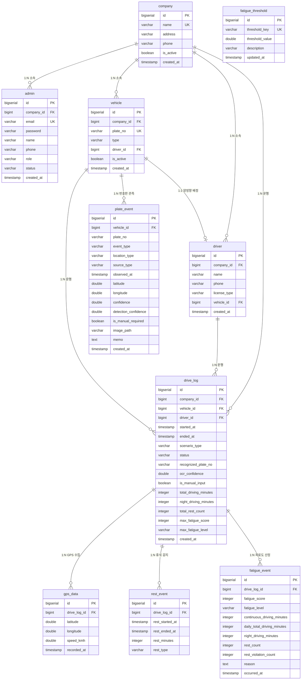

# DB 설계서

## logmile - 화물차 운전자 피로도 실시간 모니터링 플랫폼

- 프로젝트명: `logmile`
- 버전: v5.0
- 기준 산출물: `logmile_프로젝트구조도.md`, `logmile_요구사항정의서.md`
- 작성 기준일: 2026.05.12
- 변경 내용: company 테이블 추가, plate_event 테이블 추가, admin·vehicle·driver·drive_log에 company_id·status 반영, 권한 구조 ROLE_SUPER_ADMIN / ROLE_ADMIN 분리, DDL 실행 순서 갱신
- DBMS: PostgreSQL 16
- 담당: 백경서

---

## 1. 논리적 설계

### 1.1 엔티티 목록

| 엔티티 | 테이블명 | 설명 |
|---|---|---|
| 운수 업체 | `company` | 서비스 가입 업체 정보. v5.0 신규 추가 |
| 관리자 | `admin` | 관리자 계정 및 권한. ROLE_SUPER_ADMIN / ROLE_ADMIN 구분 |
| 차량 | `vehicle` | 업체 소속 화물차 정보 |
| 운전자 | `driver` | 업체 소속 화물차 운전자 기본 정보 및 차량 배정 |
| 운행 기록 | `drive_log` | 운행 시작/종료, 시나리오, OCR 인식 결과, 운행 요약 |
| 번호판 관측 이벤트 | `plate_event` | 출발/도착, 고속도로/휴게소 번호판 관측 기록. v5.0 신규 추가 |
| GPS 데이터 | `gps_data` | 운행 중 수집된 GPS 좌표 및 속도 |
| 휴식 이벤트 | `rest_event` | 운행 중 감지된 휴식 시작/종료 및 유형 |
| 피로도 이벤트 | `fatigue_event` | GPS 수신 시마다 산정된 피로도 점수 및 판단 근거 |
| 피로도 임계값 | `fatigue_threshold` | 피로도 점수 모델의 기준값 (key/value) |

---

### 1.2 엔티티 관계 (ERD)



---

### 1.3 관계 상세 설명

| 관계 | 유형 | 설명 |
|---|---|---|
| `company` → `admin` | 1:N | 업체 1개에 관리자 여러 명. `ROLE_SUPER_ADMIN`은 `company_id = NULL` |
| `company` → `vehicle` | 1:N | 업체 1개에 차량 여러 대 |
| `company` → `driver` | 1:N | 업체 1개에 운전자 여러 명 |
| `company` → `drive_log` | 1:N | 운행 기록에 업체 정보 포함. 업체 단위 데이터 격리에 사용 |
| `vehicle` ↔ `driver` | 1:1 (양방향) | 차량 1대에 운전자 1명 배정. `driver.vehicle_id`(FK/UQ) + `vehicle.driver_id`(FK/UQ) 양방향 참조. 순환 참조 방지를 위해 DDL에서 후행 `ALTER TABLE`로 처리 |
| `vehicle` → `drive_log` | 1:N | 차량 1대가 여러 번 운행 가능 |
| `driver` → `drive_log` | 1:N | 운전자 1명이 여러 운행 수행 가능 |
| `vehicle` → `plate_event` | 1:N | 차량 1대가 여러 번호판 관측 이벤트를 가질 수 있음 |
| `drive_log` → `gps_data` | 1:N | 운행 1건에 다수의 GPS 데이터 포함 |
| `drive_log` → `rest_event` | 1:N | 운행 1건에 다수의 휴식 이벤트 발생 |
| `drive_log` → `fatigue_event` | 1:N | 운행 중 GPS 수신마다 피로도 재산정 기록 |
| `fatigue_threshold` | 독립 | 다른 테이블과 FK 없음. 피로도 계산 로직에서 key로 조회 |

---

### 1.4 주요 도메인 규칙

| 규칙 | 내용 |
|---|---|
| 업체 데이터 격리 | `ROLE_ADMIN`은 자기 업체의 차량/운전자/운행 데이터만 조회 가능. `TenantAccessService`에서 `company_id` 기준 검증 |
| 관리자 권한 | `ROLE_SUPER_ADMIN`: 전체 업체 관리, 가입 승인. `ROLE_ADMIN`: 업체 단위 관제 관리 |
| 관리자 가입 상태 | 회원가입 시 `PENDING`, 승인 후 `ACTIVE`, 거절 시 `REJECTED`, 정지 시 `SUSPENDED` |
| 휴식 판단 기준 | `gps_data.speed_kmh ≤ 3` 상태가 15분 이상 지속 시 `rest_event` 생성 |
| 휴식 유형 | `PENDING`(진행 중) / `VALID`(15분 이상) / `SUFFICIENT`(30분 이상) / `INVALID`(15분 미만) |
| 야간 운행 구간 | 22:00 ~ 06:00 구간의 GPS 기록 시각 기준으로 누적 계산 |
| 피로도 등급 | NORMAL (0~39) / CAUTION (40~69) / DANGER (70 이상) |
| OCR 신뢰도 임계 | `confidence < 0.85` 시 `is_manual_required = TRUE` |
| 번호판 관측 유형 | `event_type`: ENTRY / EXIT. `location_type`: HIGHWAY_GATE / REST_AREA / CCTV |
| 번호판 출처 | `source_type`: OCR / SIMULATOR / MANUAL / DUMMY |
| 운행 상태 | RUNNING (진행 중) / COMPLETED (정상 종료) / STOPPED (중지) |

---

## 2. 물리적 설계

### 2.1 테이블 목록 및 데이터 규모 예상

| 테이블 | 예상 행 수 (시연 기준) | 증가 유형 | 보존 정책 |
|---|---|---|---|
| `company` | 10건 | 업체 가입 시 증가 | 영구 |
| `admin` | 31건 (SUPER_ADMIN 1 + 업체별 ROLE_ADMIN 3 × 10개사) | 회원가입 승인 시 증가 | 영구 |
| `vehicle` | 50건 (업체당 5대 × 10개사) | 차량 등록 시 증가 | 영구 |
| `driver` | 50건 (업체당 5명 × 10개사) | 운전자 등록 시 증가 | 영구 |
| `drive_log` | 30~100건 | 시나리오 실행 시 | 1년 |
| `plate_event` | 50~500건 | 관측 이벤트 발생 시 | 1년 |
| `gps_data` | 10,000~100,000건 | 매 GPS 수신마다 | 30일 |
| `rest_event` | 100~500건 | 운행당 수 건 | 1년 |
| `fatigue_event` | 1,000~10,000건 | GPS 수신 주기 | 1년 |
| `fatigue_threshold` | 21건 (고정) | 거의 없음 | 영구 |

---

### 2.2 인덱스 설계

| 테이블 | 인덱스명 | 컬럼 | 유형 | 목적 |
|---|---|---|---|---|
| `company` | (PK) | `id` | B-Tree | 기본키 |
| `company` | (UK) | `name` | B-Tree | 업체명 중복 방지 |
| `admin` | (PK) | `id` | B-Tree | 기본키 |
| `admin` | (UK) | `email` | B-Tree | 로그인 조회 |
| `vehicle` | (PK) | `id` | B-Tree | 기본키 |
| `vehicle` | (UK) | `plate_no` | B-Tree | 번호판 중복 방지 및 OCR 조회 |
| `driver` | (PK) | `id` | B-Tree | 기본키 |
| `drive_log` | (PK) | `id` | B-Tree | 기본키 |
| `drive_log` | `idx_drive_log_vehicle_id` | `vehicle_id` | B-Tree | 차량별 운행 이력 조회 |
| `drive_log` | `idx_drive_log_driver_id` | `driver_id` | B-Tree | 운전자별 운행 이력 조회 |
| `drive_log` | `idx_drive_log_started_at` | `started_at` | B-Tree | 날짜 기준 이력/통계 조회 |
| `plate_event` | (PK) | `id` | B-Tree | 기본키 |
| `plate_event` | `idx_plate_event_vehicle_id` | `vehicle_id` | B-Tree | 차량별 번호판 관측 이력 조회 |
| `plate_event` | `idx_plate_event_observed_at` | `observed_at` | B-Tree | 관측 시각 기준 조회 |
| `gps_data` | (PK) | `id` | B-Tree | 기본키 |
| `gps_data` | `idx_gps_data_drive_log_id` | `drive_log_id` | B-Tree | 운행별 GPS 조회 |
| `gps_data` | `idx_gps_data_recorded_at` | `recorded_at` | B-Tree | 시간대별 야간 운행 계산 |
| `rest_event` | (PK) | `id` | B-Tree | 기본키 |
| `rest_event` | `idx_rest_event_drive_log_id` | `drive_log_id` | B-Tree | 운행별 휴식 이벤트 조회 |
| `fatigue_event` | (PK) | `id` | B-Tree | 기본키 |
| `fatigue_event` | `idx_fatigue_event_drive_log_id` | `drive_log_id` | B-Tree | 운행별 피로도 이벤트 조회 |
| `fatigue_event` | `idx_fatigue_event_occurred_at` | `occurred_at` | B-Tree | 통계 집계용 시간 조회 |
| `fatigue_threshold` | (PK) | `id` | B-Tree | 기본키 |
| `fatigue_threshold` | (UK) | `threshold_key` | B-Tree | key 기반 임계값 조회 |

---

### 2.3 FK 및 CASCADE 정책

| FK | 참조 방향 | ON DELETE | 비고 |
|---|---|---|---|
| `admin.company_id` → `company.id` | admin → company | SET NULL | 업체 삭제 시 관리자 company_id 초기화 |
| `vehicle.company_id` → `company.id` | vehicle → company | SET NULL | 업체 삭제 시 차량 company_id 초기화 |
| `driver.company_id` → `company.id` | driver → company | SET NULL | 업체 삭제 시 운전자 company_id 초기화 |
| `drive_log.company_id` → `company.id` | drive_log → company | SET NULL | 업체 삭제 시 운행 company_id 초기화 |
| `driver.vehicle_id` → `vehicle.id` | driver → vehicle | SET NULL | 차량 삭제 시 운전자 vehicle_id 초기화 |
| `vehicle.driver_id` → `driver.id` | vehicle → driver | SET NULL | 운전자 삭제 시 차량 driver_id 초기화 |
| `drive_log.vehicle_id` → `vehicle.id` | drive_log → vehicle | RESTRICT | 운행 중 차량 삭제 방지 |
| `drive_log.driver_id` → `driver.id` | drive_log → driver | RESTRICT | 운행 중 운전자 삭제 방지 |
| `plate_event.vehicle_id` → `vehicle.id` | plate_event → vehicle | SET NULL | 차량 삭제 시 관측 이력 보존 |
| `gps_data.drive_log_id` → `drive_log.id` | gps_data → drive_log | CASCADE | 운행 삭제 시 GPS 데이터 함께 삭제 |
| `rest_event.drive_log_id` → `drive_log.id` | rest_event → drive_log | CASCADE | 운행 삭제 시 휴식 이벤트 함께 삭제 |
| `fatigue_event.drive_log_id` → `drive_log.id` | fatigue_event → drive_log | CASCADE | 운행 삭제 시 피로도 이벤트 함께 삭제 |

---

## 3. 테이블 명세서

---

### 3.1 company (운수 업체)

**설명:** 서비스에 가입한 운수 업체 정보. admin / vehicle / driver / drive_log에서 FK 참조. v5.0 신규 추가

| # | 컬럼명 | 데이터 타입 | NULL | 기본값 | 제약조건 | 설명 |
|---|---|---|---|---|---|---|
| 1 | `id` | `BIGSERIAL` | NOT NULL | auto | PK | 업체 식별자 (자동 증가) |
| 2 | `name` | `VARCHAR(100)` | NOT NULL | - | UK | 업체명 (중복 불가) |
| 3 | `address` | `VARCHAR(255)` | NULL | - | - | 업체 주소 |
| 4 | `phone` | `VARCHAR(20)` | NULL | - | - | 업체 연락처 |
| 5 | `is_active` | `BOOLEAN` | NOT NULL | `TRUE` | - | 업체 활성 여부 |
| 6 | `created_at` | `TIMESTAMP` | NOT NULL | `NOW()` | - | 업체 등록 시각 |

**인덱스:** PK(`id`), UK(`name`)

---

### 3.2 admin (관리자 계정)

**설명:** 시스템 관리자 계정 및 권한 정보. JWT 인증에 사용. `ROLE_SUPER_ADMIN`은 company_id = NULL

**역할 구분:**

| role | 설명 |
|---|---|
| `ROLE_SUPER_ADMIN` | logmile 서비스 운영자. 전체 업체/관리자 승인 관리 |
| `ROLE_ADMIN` | 업체 담당 관제 관리자. 자기 업체 데이터만 접근 가능 |

**계정 상태 (`status`):**

| status | 설명 |
|---|---|
| `PENDING` | 회원가입 완료, 승인 대기 중 |
| `ACTIVE` | 승인 완료, 서비스 이용 가능 |
| `REJECTED` | 가입 거절 |
| `SUSPENDED` | 계정 정지 |
| `INACTIVE` | 비활성 |

| # | 컬럼명 | 데이터 타입 | NULL | 기본값 | 제약조건 | 설명 |
|---|---|---|---|---|---|---|
| 1 | `id` | `BIGSERIAL` | NOT NULL | auto | PK | 관리자 식별자 (자동 증가) |
| 2 | `company_id` | `BIGINT` | NULL | - | FK → company.id | 소속 업체 ID. ROLE_SUPER_ADMIN은 NULL |
| 3 | `email` | `VARCHAR(100)` | NOT NULL | - | UK | 로그인 이메일 (중복 불가) |
| 4 | `password` | `VARCHAR(255)` | NOT NULL | - | - | BCrypt 암호화 패스워드 |
| 5 | `name` | `VARCHAR(50)` | NOT NULL | - | - | 관리자 이름 |
| 6 | `phone` | `VARCHAR(20)` | NULL | - | - | 관리자 연락처 |
| 7 | `role` | `VARCHAR(20)` | NOT NULL | `'ROLE_ADMIN'` | CHK | 권한 (`ROLE_SUPER_ADMIN` / `ROLE_ADMIN`) |
| 8 | `status` | `VARCHAR(20)` | NOT NULL | `'ACTIVE'` | CHK | 계정 상태 (`PENDING` / `ACTIVE` / `REJECTED` / `SUSPENDED` / `INACTIVE`) |
| 9 | `created_at` | `TIMESTAMP` | NOT NULL | `NOW()` | - | 계정 생성 시각 |

**인덱스:** PK(`id`), UK(`email`)

---

### 3.3 vehicle (차량)

**설명:** 업체 소속 화물차 정보. 운전자와 1:1 배정 관계

| # | 컬럼명 | 데이터 타입 | NULL | 기본값 | 제약조건 | 설명 |
|---|---|---|---|---|---|---|
| 1 | `id` | `BIGSERIAL` | NOT NULL | auto | PK | 차량 식별자 (자동 증가) |
| 2 | `company_id` | `BIGINT` | NULL | - | FK → company.id | 소속 업체 ID |
| 3 | `plate_no` | `VARCHAR(20)` | NOT NULL | - | UK | 차량 번호판 (중복 불가) |
| 4 | `type` | `VARCHAR(50)` | NOT NULL | - | - | 차종 (예: 5톤 카고, 11톤 윙바디) |
| 5 | `driver_id` | `BIGINT` | NULL | - | FK/UQ → driver.id | 현재 배정된 운전자 ID |
| 6 | `is_active` | `BOOLEAN` | NOT NULL | `TRUE` | - | 차량 활성 여부 |
| 7 | `created_at` | `TIMESTAMP` | NOT NULL | `NOW()` | - | 차량 등록 시각 |

**인덱스:** PK(`id`), UK(`plate_no`)

**비고:** `driver_id` FK는 순환 참조 방지를 위해 `driver` 테이블 생성 후 `ALTER TABLE`로 후행 추가

---

### 3.4 driver (운전자)

**설명:** 업체 소속 화물차 운전자 기본 정보 및 차량 배정 상태

| # | 컬럼명 | 데이터 타입 | NULL | 기본값 | 제약조건 | 설명 |
|---|---|---|---|---|---|---|
| 1 | `id` | `BIGSERIAL` | NOT NULL | auto | PK | 운전자 식별자 (자동 증가) |
| 2 | `company_id` | `BIGINT` | NULL | - | FK → company.id | 소속 업체 ID |
| 3 | `name` | `VARCHAR(50)` | NOT NULL | - | - | 운전자 이름 |
| 4 | `phone` | `VARCHAR(20)` | NOT NULL | - | - | 연락처 (위험 시 전화 연결에 사용) |
| 5 | `license_type` | `VARCHAR(30)` | NOT NULL | - | - | 면허 종류 (예: 1종 대형, 1종 보통) |
| 6 | `vehicle_id` | `BIGINT` | NULL | - | FK/UQ → vehicle.id | 배정된 차량 ID |
| 7 | `created_at` | `TIMESTAMP` | NOT NULL | `NOW()` | - | 운전자 등록 시각 |

**인덱스:** PK(`id`)

---

### 3.5 drive_log (운행 기록)

**설명:** 운행 시작/종료, 시나리오 유형, OCR 번호판 인식 결과, 운행 완료 요약 저장

| # | 컬럼명 | 데이터 타입 | NULL | 기본값 | 제약조건 | 설명 |
|---|---|---|---|---|---|---|
| 1 | `id` | `BIGSERIAL` | NOT NULL | auto | PK | 운행 기록 식별자 |
| 2 | `company_id` | `BIGINT` | NULL | - | FK → company.id | 소속 업체 ID |
| 3 | `vehicle_id` | `BIGINT` | NOT NULL | - | FK → vehicle.id | 운행 차량 ID |
| 4 | `driver_id` | `BIGINT` | NOT NULL | - | FK → driver.id | 운행 운전자 ID |
| 5 | `started_at` | `TIMESTAMP` | NOT NULL | - | - | 운행 시작 시각 |
| 6 | `ended_at` | `TIMESTAMP` | NULL | - | - | 운행 종료 시각 (진행 중이면 NULL) |
| 7 | `scenario_type` | `VARCHAR(10)` | NOT NULL | - | CHK | 시나리오 유형 (`A`: 정상, `B`: 주의, `C`: 위험) |
| 8 | `status` | `VARCHAR(20)` | NOT NULL | `'RUNNING'` | CHK | 운행 상태 (`RUNNING` / `COMPLETED` / `STOPPED`) |
| 9 | `recognized_plate_no` | `VARCHAR(20)` | NULL | - | - | OCR 인식 번호판 텍스트 |
| 10 | `ocr_confidence` | `DOUBLE PRECISION` | NULL | - | - | OCR 신뢰도 (0.0~1.0). 0.85 미만 시 수동 입력 |
| 11 | `is_manual_input` | `BOOLEAN` | NOT NULL | `FALSE` | - | 수동 입력 여부 (`TRUE`: fallback 수동 입력) |
| 12 | `total_driving_minutes` | `INTEGER` | NULL | - | - | 총 운행 시간(분). 운행 종료 시 기록 |
| 13 | `night_driving_minutes` | `INTEGER` | NULL | - | - | 야간 운행 시간(분). 22:00~06:00 기준. 종료 시 기록 |
| 14 | `total_rest_count` | `INTEGER` | NULL | - | - | 유효 휴식 총 횟수. 운행 종료 시 기록 |
| 15 | `max_fatigue_score` | `INTEGER` | NULL | - | - | 운행 중 최고 피로 점수. 종료 시 기록 |
| 16 | `max_fatigue_level` | `VARCHAR(20)` | NULL | - | CHK | 운행 중 최고 피로 등급 (`NORMAL` / `CAUTION` / `DANGER`) |
| 17 | `created_at` | `TIMESTAMP` | NOT NULL | `NOW()` | - | 레코드 생성 시각 |

**인덱스:** PK(`id`), `idx_drive_log_vehicle_id`, `idx_drive_log_driver_id`, `idx_drive_log_started_at`

---

### 3.6 plate_event (번호판 관측 이벤트)

**설명:** 출발/도착, 고속도로 게이트, 휴게소 진입/진출 번호판 관측 기록. OCR/시뮬레이터/수동 입력 구분. v5.0 신규 추가

**event_type 값:**

| 값 | 설명 |
|---|---|
| `ENTRY` | 진입 이벤트 |
| `EXIT` | 진출 이벤트 |

**location_type 값:**

| 값 | 설명 |
|---|---|
| `HIGHWAY_GATE` | 고속도로 게이트 |
| `REST_AREA` | 휴게소 |
| `CCTV` | 일반 CCTV |

**source_type 값:**

| 값 | 설명 |
|---|---|
| `OCR` | YOLO11n + EasyOCR 인식 |
| `SIMULATOR` | GPS 시뮬레이터 생성 |
| `MANUAL` | 수동 입력 |
| `DUMMY` | 테스트용 더미 데이터 |

| # | 컬럼명 | 데이터 타입 | NULL | 기본값 | 제약조건 | 설명 |
|---|---|---|---|---|---|---|
| 1 | `id` | `BIGSERIAL` | NOT NULL | auto | PK | 이벤트 식별자 (자동 증가) |
| 2 | `vehicle_id` | `BIGINT` | NULL | - | FK → vehicle.id (SET NULL) | 매칭된 차량 ID. 미매칭 시 NULL |
| 3 | `plate_no` | `VARCHAR(20)` | NOT NULL | - | - | 관측 또는 입력된 번호판 문자열 |
| 4 | `event_type` | `VARCHAR(20)` | NOT NULL | - | CHK | 입출차 이벤트 유형 (`ENTRY` / `EXIT`) |
| 5 | `location_type` | `VARCHAR(30)` | NOT NULL | - | CHK | 관측 장소 유형 (`HIGHWAY_GATE` / `REST_AREA` / `CCTV`) |
| 6 | `source_type` | `VARCHAR(20)` | NOT NULL | - | CHK | 번호판 출처 (`OCR` / `SIMULATOR` / `MANUAL` / `DUMMY`) |
| 7 | `observed_at` | `TIMESTAMP` | NOT NULL | - | - | 관측 시각 |
| 8 | `latitude` | `DOUBLE PRECISION` | NULL | - | - | 관측 위도 |
| 9 | `longitude` | `DOUBLE PRECISION` | NULL | - | - | 관측 경도 |
| 10 | `confidence` | `DOUBLE PRECISION` | NULL | - | CHK(0~1) | OCR 문자 인식 신뢰도 |
| 11 | `detection_confidence` | `DOUBLE PRECISION` | NULL | - | CHK(0~1) | YOLO 번호판 탐지 신뢰도 |
| 12 | `is_manual_required` | `BOOLEAN` | NOT NULL | `FALSE` | - | 수동 입력 필요 여부 (`confidence < 0.85`) |
| 13 | `image_path` | `VARCHAR(500)` | NULL | - | - | 원본 이미지 경로 |
| 14 | `memo` | `TEXT` | NULL | - | - | 비고 |
| 15 | `created_at` | `TIMESTAMP` | NOT NULL | `NOW()` | - | 레코드 생성 시각 |

**인덱스:** PK(`id`), `idx_plate_event_vehicle_id`, `idx_plate_event_observed_at`

---

### 3.7 gps_data (GPS 데이터)

**설명:** 시뮬레이터가 전송하는 GPS 좌표 및 속도 데이터. 피로도 계산의 원천 데이터

| # | 컬럼명 | 데이터 타입 | NULL | 기본값 | 제약조건 | 설명 |
|---|---|---|---|---|---|---|
| 1 | `id` | `BIGSERIAL` | NOT NULL | auto | PK | GPS 데이터 식별자 |
| 2 | `drive_log_id` | `BIGINT` | NOT NULL | - | FK → drive_log.id (CASCADE) | 소속 운행 기록 ID |
| 3 | `latitude` | `DOUBLE PRECISION` | NOT NULL | - | - | 위도 (WGS84) |
| 4 | `longitude` | `DOUBLE PRECISION` | NOT NULL | - | - | 경도 (WGS84) |
| 5 | `speed_kmh` | `DOUBLE PRECISION` | NOT NULL | `0.0` | - | 차량 속도 (km/h). **3 이하는 정차로 판단** |
| 6 | `recorded_at` | `TIMESTAMP` | NOT NULL | - | - | GPS 기록 시각 (시뮬레이터 기준 시각) |

**인덱스:** PK(`id`), `idx_gps_data_drive_log_id`, `idx_gps_data_recorded_at`

**보존 정책:** 30일 후 삭제

---

### 3.8 rest_event (휴식 이벤트)

**설명:** `speed_kmh ≤ 3` 조건 감지 시 생성. 종료 후 `rest_type` 및 `rest_minutes` 확정

| # | 컬럼명 | 데이터 타입 | NULL | 기본값 | 제약조건 | 설명 |
|---|---|---|---|---|---|---|
| 1 | `id` | `BIGSERIAL` | NOT NULL | auto | PK | 휴식 이벤트 식별자 |
| 2 | `drive_log_id` | `BIGINT` | NOT NULL | - | FK → drive_log.id (CASCADE) | 소속 운행 기록 ID |
| 3 | `rest_started_at` | `TIMESTAMP` | NOT NULL | - | - | 휴식 시작 시각 |
| 4 | `rest_ended_at` | `TIMESTAMP` | NULL | - | - | 휴식 종료 시각 (진행 중이면 NULL) |
| 5 | `rest_minutes` | `INTEGER` | NULL | - | - | 실제 휴식 시간(분). 종료 후 계산하여 저장 |
| 6 | `rest_type` | `VARCHAR(20)` | NOT NULL | `'PENDING'` | CHK | 휴식 유형 |

**`rest_type` 값 정의:**

| 값 | 조건 | 설명 |
|---|---|---|
| `PENDING` | 진행 중 | 휴식 중인 상태 (아직 종료 안 됨) |
| `VALID` | 15분 이상 | 유효 휴식 → 피로도 보정 -10점 |
| `SUFFICIENT` | 30분 이상 | 충분 휴식 → 피로도 보정 -20점 |
| `INVALID` | 15분 미만 | 휴식 미달. 보정 없음 |

**인덱스:** PK(`id`), `idx_rest_event_drive_log_id`

---

### 3.9 fatigue_event (피로도 이벤트)

**설명:** GPS 데이터 수신 시마다 피로도를 재산정하여 기록. 대시보드 실시간 표시 및 운행 이력 조회에 사용

| # | 컬럼명 | 데이터 타입 | NULL | 기본값 | 제약조건 | 설명 |
|---|---|---|---|---|---|---|
| 1 | `id` | `BIGSERIAL` | NOT NULL | auto | PK | 피로도 이벤트 식별자 |
| 2 | `drive_log_id` | `BIGINT` | NOT NULL | - | FK → drive_log.id (CASCADE) | 소속 운행 기록 ID |
| 3 | `fatigue_score` | `INTEGER` | NOT NULL | `0` | - | 피로도 총점 |
| 4 | `fatigue_level` | `VARCHAR(20)` | NOT NULL | `'NORMAL'` | CHK | 피로 등급 (`NORMAL` / `CAUTION` / `DANGER`) |
| 5 | `continuous_driving_minutes` | `INTEGER` | NOT NULL | `0` | - | 연속 운행 시간(분). 유효 휴식 전까지 누적 |
| 6 | `daily_total_driving_minutes` | `INTEGER` | NOT NULL | `0` | - | 당일 총 운행 시간(분). 운전자 기준 누적 |
| 7 | `night_driving_minutes` | `INTEGER` | NOT NULL | `0` | - | 야간 운행 누적 시간(분). 22:00~06:00 기준 |
| 8 | `rest_count` | `INTEGER` | NOT NULL | `0` | - | 유효 휴식 횟수 (VALID + SUFFICIENT) |
| 9 | `rest_violation_count` | `INTEGER` | NOT NULL | `0` | - | 휴식 누락 횟수 (2시간 운행 후 미휴식) |
| 10 | `reason` | `TEXT` | NULL | - | - | 점수 산정 근거 텍스트 |
| 11 | `occurred_at` | `TIMESTAMP` | NOT NULL | `NOW()` | - | 피로도 산정 시각 |

**피로 등급 기준:**

| 등급 | 점수 범위 | 조치 |
|---|---|---|
| `NORMAL` | 0 ~ 39 | 정상 배지 표시 |
| `CAUTION` | 40 ~ 69 | 주의 배지 표시 |
| `DANGER` | 70 이상 | 위험 배지 + 전화 권고 |

**인덱스:** PK(`id`), `idx_fatigue_event_drive_log_id`, `idx_fatigue_event_occurred_at`

---

### 3.10 fatigue_threshold (피로도 임계값)

**설명:** 피로도 점수 모델의 기준값을 key/value로 관리. 관리자 화면에서 동적 수정 가능

| # | 컬럼명 | 데이터 타입 | NULL | 기본값 | 제약조건 | 설명 |
|---|---|---|---|---|---|---|
| 1 | `id` | `BIGSERIAL` | NOT NULL | auto | PK | 임계값 식별자 |
| 2 | `threshold_key` | `VARCHAR(100)` | NOT NULL | - | UK | 임계값 식별 키 (중복 불가) |
| 3 | `threshold_value` | `DOUBLE PRECISION` | NOT NULL | - | - | 임계값 (분 또는 점수 단위) |
| 4 | `description` | `VARCHAR(255)` | NULL | - | - | 임계값 설명 |
| 5 | `updated_at` | `TIMESTAMP` | NOT NULL | `NOW()` | - | 최종 수정 시각 |

**인덱스:** PK(`id`), UK(`threshold_key`)

**기본 시드 데이터 (21건):**

| threshold_key | threshold_value | 설명 |
|---|---:|---|
| `CONTINUOUS_DRIVING_90` | 90 | 연속 운행 90분 이상 → +10점 |
| `CONTINUOUS_DRIVING_120` | 120 | 연속 운행 120분 이상 → +25점 |
| `CONTINUOUS_DRIVING_180` | 180 | 연속 운행 180분 이상 → +45점 |
| `CONTINUOUS_DRIVING_240` | 240 | 연속 운행 240분 이상 → +65점 |
| `DAILY_DRIVING_360` | 360 | 일일 총 운행 6시간 이상 → +15점 |
| `DAILY_DRIVING_480` | 480 | 일일 총 운행 8시간 이상 → +30점 |
| `DAILY_DRIVING_600` | 600 | 일일 총 운행 10시간 이상 → +45점 |
| `NIGHT_DRIVING_30` | 30 | 야간 운행 누적 30분 이상 → +10점 |
| `NIGHT_DRIVING_60` | 60 | 야간 운행 누적 1시간 이상 → +20점 |
| `NIGHT_DRIVING_120` | 120 | 야간 운행 누적 2시간 이상 → +35점 |
| `REST_VALID_MINUTES` | 15 | 유효 휴식 기준 (분) |
| `REST_SUFFICIENT_MINUTES` | 30 | 충분 휴식 기준 (분) |
| `REST_REQUIRED_AFTER` | 120 | 2시간 운행 후 휴식 필요 |
| `REST_VIOLATION_ONCE_SCORE` | 10 | 휴식 누락 1회 → +10점 |
| `REST_VIOLATION_TWICE_SCORE` | 25 | 휴식 누락 2회 이상 → +25점 |
| `REST_CORRECTION_VALID_SCORE` | 10 | 유효 휴식 보정 → -10점 |
| `REST_CORRECTION_SUFFICIENT_SCORE` | 20 | 충분 휴식 보정 → -20점 |
| `LEVEL_NORMAL_MAX` | 39 | 정상 등급 최대 점수 |
| `LEVEL_CAUTION_MIN` | 40 | 주의 등급 최소 점수 |
| `LEVEL_CAUTION_MAX` | 69 | 주의 등급 최대 점수 |
| `LEVEL_DANGER_MIN` | 70 | 위험 등급 최소 점수 |

---

## 4. DDL 실행 순서

순환 FK 구조로 인해 아래 순서를 반드시 준수해야 합니다.

```
1.  company          (의존 없음)
2.  admin            (company FK 포함)
3.  vehicle          (company FK 포함. driver FK는 제외하고 생성)
4.  driver           (company FK + vehicle FK 포함)
5.  ALTER TABLE vehicle ADD CONSTRAINT fk_vehicle_driver  ← 순환 FK 후행 추가
6.  drive_log        (company + vehicle + driver FK 포함)
7.  plate_event      (vehicle FK, SET NULL)
8.  gps_data         (drive_log FK, CASCADE)
9.  rest_event       (drive_log FK, CASCADE)
10. fatigue_event    (drive_log FK, CASCADE)
11. fatigue_threshold (의존 없음)
```

---

## 5. 시드 데이터 실행 순서

```
1. company           INSERT 10건
2. admin             INSERT 31건 (SUPER_ADMIN 1 + 업체별 ROLE_ADMIN 3 × 10개사)
3. vehicle           INSERT 50건 (업체당 5대, driver_id 없이)
4. driver            INSERT 50건 (업체당 5명, vehicle_id 포함)
5. vehicle           UPDATE 50건 (driver_id 역방향 업데이트)
6. fatigue_threshold INSERT 21건
```
