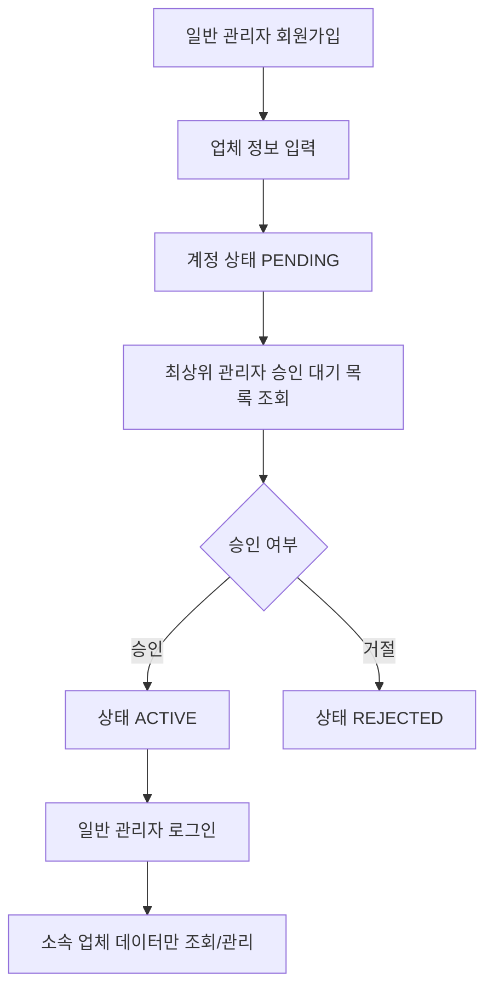
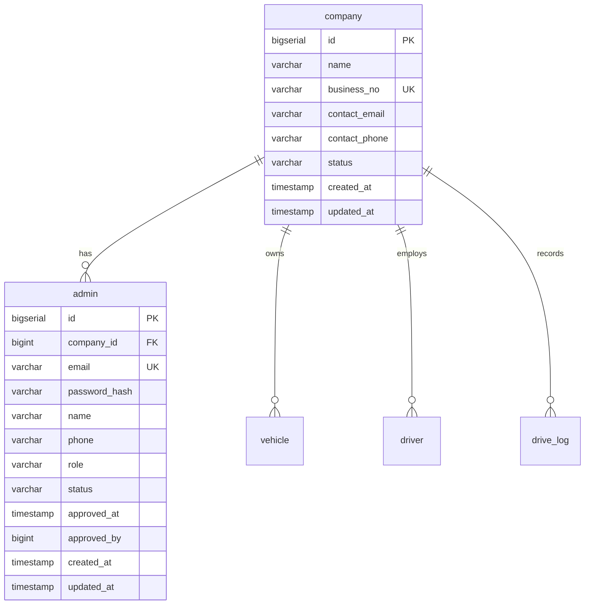

# 최상위 관리자 구조 수정 사항 정리

## logmile - 관리자 권한 구조 변경 검토

- 프로젝트명: `logmile`
- 버전: v4.0
- 작성 기준일: 2026.04.29
- 작성 목적: 최상위 관리자와 일반 관리자 구조 도입을 위해 기존 산출물에서 수정해야 하는 항목을 정리한다.
- 검토 대상:
  - `logmile_요구사항정의서.md`
  - `logmile_DB설계서.md`
  - `logmile_프로젝트구조도.md`
  - `logmile_WBS_초안.md`
  - `logmile_팀원별_기능구현_브랜치순서.md`
  - `logmile_깃허브_브랜치전략.md`
  - `logmile_infra/db/init.sql`
  - `logmile_infra/db/seed.sql`

---

## 1. 검토 결론

현재 산출물은 대부분 단일 관리자 권한인 `ROLE_ADMIN` 기준으로 작성되어 있다.

최상위 관리자와 일반 관리자 구조는 WBS에는 일부 계획으로 반영되어 있으나, 요구사항 정의서, DB 설계서, 프로젝트 구조도, 초기 SQL에는 아직 완전히 반영되어 있지 않다.

따라서 현재 구조를 그대로 구현할 경우 다음 문제가 발생할 수 있다.

| 구분 | 문제 |
|---|---|
| 권한 구조 | 최상위 관리자와 일반 관리자를 구분할 수 없다. |
| 회원가입 | 일반 관리자가 직접 회원가입 후 승인 대기하는 흐름이 정의되어 있지 않다. |
| 승인 관리 | 최상위 관리자의 승인, 거절, 정지, 해제 기능이 누락되어 있다. |
| 데이터 격리 | 업체별 차량, 운전자, 운행 데이터 분리가 어렵다. |
| DB 구조 | `company` 기준의 업체 관리 구조가 없다. |
| API 구조 | 회원가입, 승인 관리, 업체 관리 API가 정의되어 있지 않다. |
| 화면 구조 | 최상위 관리자 화면과 승인 대기 화면이 부족하다. |

---

## 2. 목표 권한 구조

### 2.1 사용자 유형

| 사용자 | 권한 | 설명 |
|---|---|---|
| 최상위 관리자 | `ROLE_SUPER_ADMIN` | 전체 업체 관리자 계정과 업체 정보를 관리한다. |
| 일반 관리자 | `ROLE_COMPANY_ADMIN` | 소속 업체의 차량, 운전자, 운행 데이터, 피로도 정보를 관리한다. |

### 2.2 일반 관리자 상태

| 상태 | 설명 |
|---|---|
| `PENDING` | 회원가입 완료 후 최상위 관리자 승인 대기 상태 |
| `ACTIVE` | 승인 완료 후 서비스 사용 가능 상태 |
| `REJECTED` | 가입 요청이 거절된 상태 |
| `SUSPENDED` | 사용이 일시 정지된 상태 |

### 2.3 기본 흐름

---

## 3. 문서별 수정 필요 사항

## 3.1 요구사항 정의서

현재 요구사항 정의서는 `관제 관리자`, `시스템 관리자`가 모두 `ROLE_ADMIN`으로 정의되어 있다.

다음과 같이 사용자 및 권한 정의를 수정해야 한다.

| 기존 | 변경 |
|---|---|
| 관제 관리자 / `ROLE_ADMIN` | 일반 관리자 / `ROLE_COMPANY_ADMIN` |
| 시스템 관리자 / `ROLE_ADMIN` | 최상위 관리자 / `ROLE_SUPER_ADMIN` |

### 추가해야 할 기능 요구사항

| ID | 기능 | 요구사항 |
|---|---|---|
| FR-AUTH01 | 관리자 로그인 | `ACTIVE` 상태의 관리자만 JWT 로그인할 수 있다. |
| FR-AUTH02 | 일반 관리자 회원가입 | 업체명, 사업자번호, 담당자 정보, 계정 정보를 입력해 가입 요청을 생성한다. |
| FR-AUTH03 | 승인 대기 처리 | `PENDING` 상태 계정은 로그인 또는 주요 기능 접근을 제한한다. |
| FR-SUPER01 | 승인 대기 목록 조회 | 최상위 관리자는 가입 승인 대기 중인 일반 관리자 목록을 조회한다. |
| FR-SUPER02 | 가입 승인 | 최상위 관리자는 일반 관리자 계정을 승인하고 상태를 `ACTIVE`로 변경한다. |
| FR-SUPER03 | 가입 거절 | 최상위 관리자는 가입 요청을 거절하고 상태를 `REJECTED`로 변경한다. |
| FR-SUPER04 | 계정 정지/해제 | 최상위 관리자는 일반 관리자 계정을 `SUSPENDED` 또는 `ACTIVE`로 변경한다. |
| FR-COMPANY01 | 내 업체 정보 조회 | 일반 관리자는 자신의 소속 업체 정보를 조회한다. |
| FR-COMPANY02 | 업체별 데이터 접근 제한 | 일반 관리자는 소속 업체의 차량, 운전자, 운행 데이터만 조회/관리할 수 있다. |

---

## 3.2 DB 설계서

현재 DB 설계서는 `admin` 테이블만 존재하며 업체 정보와 승인 상태를 관리할 수 없다.

### 추가 필요 테이블

#### company

| 컬럼 | 타입 | 제약 | 설명 |
|---|---|---|---|
| id | bigserial | PK | 업체 ID |
| name | varchar(100) | not null | 업체명 |
| business_no | varchar(30) | unique | 사업자번호 또는 업체 식별번호 |
| contact_email | varchar(100) |  | 업체 연락 이메일 |
| contact_phone | varchar(30) |  | 업체 연락처 |
| status | varchar(20) | not null | 업체 상태 |
| created_at | timestamp | not null | 생성 일시 |
| updated_at | timestamp |  | 수정 일시 |

### 수정 필요 테이블

#### admin

| 컬럼 | 수정 내용 |
|---|---|
| company_id | 일반 관리자 소속 업체 FK 추가 |
| password | `password_hash` 명칭 검토 |
| role | `ROLE_SUPER_ADMIN`, `ROLE_COMPANY_ADMIN` 구분 |
| status | `PENDING`, `ACTIVE`, `REJECTED`, `SUSPENDED` 상태 추가 |
| approved_at | 승인 일시 추가 |
| approved_by | 승인한 최상위 관리자 ID 추가 |
| updated_at | 수정 일시 추가 |

#### vehicle

| 컬럼 | 수정 내용 |
|---|---|
| company_id | 차량이 속한 업체 FK 추가 |

#### driver

| 컬럼 | 수정 내용 |
|---|---|
| company_id | 운전자가 속한 업체 FK 추가 |

#### drive_log

| 컬럼 | 수정 내용 |
|---|---|
| company_id | 운행 기록이 속한 업체 FK 추가 |

#### fatigue_threshold

| 컬럼 | 수정 내용 |
|---|---|
| company_id | 업체별 피로도 기준값을 허용할 경우 FK 추가 검토 |

### ERD 수정 방향

---

## 3.3 프로젝트 구조도

현재 프로젝트 구조도는 `AuthController`, `AdminService`, `AdminRepository`, `Admin` 중심으로 작성되어 있다.

최상위 관리자 구조를 반영하려면 다음 모듈을 추가해야 한다.

### Backend 추가 모듈

| 계층 | 추가 대상 | 역할 |
|---|---|---|
| Controller | `SignupController` | 일반 관리자 회원가입 요청 처리 |
| Controller | `SuperAdminController` | 승인 대기, 승인, 거절, 정지, 해제 처리 |
| Controller | `CompanyController` | 업체 정보 조회 및 관리 |
| Service | `CompanyService` | 업체 등록, 조회, 상태 관리 |
| Service | `AdminApprovalService` | 관리자 승인/거절/정지 로직 |
| Service | `TenantAccessService` | 업체별 데이터 접근 제한 검증 |
| Repository | `CompanyRepository` | 업체 데이터 접근 |
| Entity | `Company` | 업체 엔티티 |
| Enum | `AdminRole` | 관리자 권한 정의 |
| Enum | `AdminStatus` | 관리자 상태 정의 |
| Enum | `CompanyStatus` | 업체 상태 정의 |

### Frontend 추가 화면

| 화면 | 설명 |
|---|---|
| `SignupView` | 일반 관리자 회원가입 화면 |
| `PendingApprovalView` | 승인 대기 안내 화면 |
| `SuperAdminDashboardView` | 최상위 관리자 전용 대시보드 |
| `AdminApprovalView` | 가입 승인/거절 목록 화면 |
| `CompanyManagementView` | 업체 목록 및 상태 관리 화면 |
| `CompanyInfoView` | 일반 관리자 내 업체 정보 화면 |

### Frontend 상태 관리 수정

| 대상 | 수정 내용 |
|---|---|
| `authStore` | `role`, `status`, `companyId` 저장 |
| Router Guard | 권한과 상태에 따른 접근 제한 |
| Axios Interceptor | JWT 만료 및 승인 대기 상태 응답 처리 |

---

## 3.4 API 정의 수정

현재 API 구조는 `POST /api/auth/login` 중심이다.

다음 API를 추가로 정의해야 한다.

### 인증/회원가입 API

| Method | URL | 설명 |
|---|---|---|
| POST | `/api/auth/login` | 관리자 로그인 |
| POST | `/api/auth/signup` | 일반 관리자 회원가입 |
| GET | `/api/auth/me` | 현재 로그인 사용자 정보 조회 |

### 최상위 관리자 API

| Method | URL | 설명 |
|---|---|---|
| GET | `/api/super/admins/pending` | 승인 대기 관리자 목록 조회 |
| PATCH | `/api/super/admins/{adminId}/approve` | 일반 관리자 승인 |
| PATCH | `/api/super/admins/{adminId}/reject` | 일반 관리자 거절 |
| PATCH | `/api/super/admins/{adminId}/suspend` | 일반 관리자 정지 |
| PATCH | `/api/super/admins/{adminId}/activate` | 일반 관리자 정지 해제 |
| GET | `/api/super/companies` | 업체 목록 조회 |
| GET | `/api/super/companies/{companyId}` | 업체 상세 조회 |

### 일반 관리자 API

| Method | URL | 설명 |
|---|---|---|
| GET | `/api/company/me` | 내 업체 정보 조회 |
| GET | `/api/dashboard/summary` | 소속 업체 기준 대시보드 요약 |
| GET | `/api/vehicles` | 소속 업체 차량 목록 |
| GET | `/api/drivers` | 소속 업체 운전자 목록 |
| GET | `/api/drive-logs` | 소속 업체 운행 이력 |

---

## 3.5 init.sql / seed.sql

현재 초기 SQL은 `admin` 테이블만 생성하고 `ROLE_ADMIN` 계정만 입력한다.

### init.sql 수정 필요 사항

| 대상 | 수정 내용 |
|---|---|
| `company` | 신규 테이블 생성 |
| `admin` | `company_id`, `status`, `approved_at`, `approved_by`, `updated_at` 컬럼 추가 |
| `admin.role` | `ROLE_SUPER_ADMIN`, `ROLE_COMPANY_ADMIN` 값 허용 |
| `admin.status` | `PENDING`, `ACTIVE`, `REJECTED`, `SUSPENDED` 값 허용 |
| `vehicle` | `company_id` FK 추가 |
| `driver` | `company_id` FK 추가 |
| `drive_log` | `company_id` FK 추가 |
| Index | `company_id`, `role`, `status`, `business_no` 기준 인덱스 추가 검토 |

### seed.sql 수정 필요 사항

| 대상 | 수정 내용 |
|---|---|
| 최상위 관리자 | `ROLE_SUPER_ADMIN`, `ACTIVE` 상태 계정 추가 |
| 샘플 업체 | 테스트용 업체 데이터 추가 |
| 일반 관리자 | 샘플 업체에 소속된 `ROLE_COMPANY_ADMIN`, `ACTIVE` 상태 계정 추가 |
| 차량/운전자 | 샘플 업체 `company_id`를 포함해 입력 |

---

## 3.6 WBS 수정

WBS에는 최상위 관리자 관련 항목이 일부 포함되어 있으나, 요구사항과 DB 설계가 확정된 뒤 세부 작업을 보강해야 한다.

| WBS 항목 | 수정 방향 |
|---|---|
| PL-005 관리자 권한 구조 검토 | 완료 기준을 요구사항/DB/API 반영까지 확장 |
| BE-002 권한 구조 | Entity, Enum, Security 설정까지 세분화 |
| BE-004 회원가입/승인 API | 회원가입, 승인, 거절, 정지, 해제 API로 분리 |
| FE-003 회원가입/승인 대기 | 회원가입 화면과 승인 대기 화면을 별도 작업으로 분리 |
| FE-005 최상위 관리자 화면 | 승인 관리, 업체 관리 화면으로 세분화 |

---

## 3.7 브랜치 전략 및 작업 순서 문서

`logmile_팀원별_기능구현_브랜치순서.md`, `logmile_깃허브_브랜치전략.md`에는 아직 `ROLE_ADMIN` 기준 설명이 남아 있다.

다음 브랜치 또는 작업 단위를 추가하는 방향으로 수정이 필요하다.

| 브랜치 | 목적 |
|---|---|
| `feature/be-company-entity` | 업체 테이블, Entity, Repository 추가 |
| `feature/be-auth-signup` | 일반 관리자 회원가입 API 구현 |
| `feature/be-admin-approval` | 최상위 관리자 승인/거절/정지 API 구현 |
| `feature/be-tenant-access` | 업체별 데이터 접근 제한 처리 |
| `feature/fe-signup` | 일반 관리자 회원가입 화면 구현 |
| `feature/fe-approval-pending` | 승인 대기 화면 구현 |
| `feature/fe-super-admin` | 최상위 관리자 승인/업체 관리 화면 구현 |

---

## 4. 수정 우선순위

| 우선순위 | 대상 | 이유 |
|---|---|---|
| 1 | 요구사항 정의서 | 권한, 회원가입, 승인 흐름의 기준 문서 |
| 2 | DB 설계서 | 업체별 데이터 격리와 승인 상태의 기준 구조 |
| 3 | init.sql / seed.sql | 실제 개발 환경 초기화 기준 |
| 4 | 프로젝트 구조도 | Backend/Frontend 모듈 구조 기준 |
| 5 | API 정의 | FE/BE 연동 기준 |
| 6 | WBS | 일정과 역할 분담 기준 |
| 7 | 브랜치 전략 및 작업 순서 | 실제 개발 진행 순서 기준 |

---

## 5. 구현 전 확정 필요 사항

| 항목 | 확인 필요 내용 |
|---|---|
| 최상위 관리자 데이터 조회 범위 | 모든 업체의 운행 데이터를 조회할 수 있는지, 계정/업체 관리만 담당하는지 결정 |
| 피로도 임계값 범위 | 전체 공통 기준인지, 업체별 설정을 허용할지 결정 |
| 업체 관리자 수 | 한 업체에 여러 명의 일반 관리자를 둘 수 있는지 결정 |
| 업체 식별값 | 사업자번호를 필수/중복 불가로 사용할지 결정 |
| 회원가입 승인 정책 | 거절된 계정의 재신청 허용 여부 결정 |
| 정지 정책 | 정지된 관리자의 로그인 차단 범위와 데이터 보존 정책 결정 |

---

## 6. 최종 정리

최상위 관리자 구조를 적용하려면 단순히 권한명만 추가하는 수준이 아니라, 업체 기준의 데이터 소유 구조와 승인 상태 관리가 함께 반영되어야 한다.

따라서 다음 순서로 산출물을 수정하는 것이 적절하다.

1. 요구사항 정의서에서 관리자 권한과 회원가입/승인 흐름을 확정한다.
2. DB 설계서에서 `company`, `admin.status`, 업체별 FK 구조를 확정한다.
3. 초기 SQL과 seed 데이터를 DB 설계서 기준으로 수정한다.
4. 프로젝트 구조도에 Backend/Frontend 모듈과 API 흐름을 반영한다.
5. WBS와 브랜치 전략 문서를 수정된 구조에 맞게 동기화한다.
